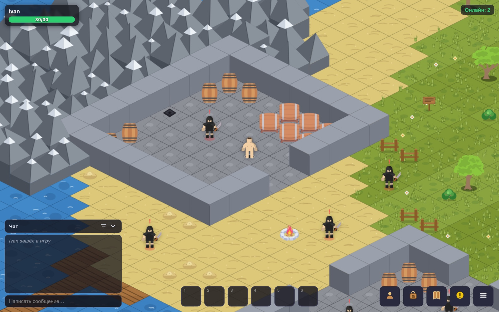

# Браузерная MMORPG

Многопользовательская онлайн-RPG в браузере: изометрическая тайловая карта, игроки видят друг друга в реальном времени, бой с мобами, лут, инвентарь, экипировка и прокачка. Референс по духу и геймплею — RPG MO.



## Архитектура

- **Сервер** (`server/`) — Node.js + Socket.IO. Держит состояние мира: карту, мобов, игроков, бой, лут. Клиент ничего не решает сам.
- **Клиент** (`client/`) — HTML5 Canvas и чистый JS, без движка. Рисует изометрию, спрайты и интерфейс.
- **Редактор карт** (`client-admin/`) — рисование тайлов, расстановка мобов и НПС, правка предметов; изменения уходят на сервер и применяются вживую, без перезапуска.

## Что уже работает

- Изометрическая карта из тайлов, синхронизация движения игроков через WebSocket
- Бой, мобы с респавном, дроп и подбор лута
- Инвентарь, экипировка по слотам, характеристики и уровни
- Реестр предметов как единственный источник правды — списки в редакторе строятся из него, а не хардкодом
- Система баланса экономики (`BALANCE.md`): цена и цена продажи выводятся из связки «тир × категория»

## Запуск

```bash
cd server && npm install && node server.js
```

Клиент открывается по адресу сервера, редактор карт — на `/admin`.

## Стек

Node.js, Socket.IO, HTML5 Canvas. Графика — SVG-ассеты в `client/assets/`.

## Статус

Рабочий прототип, играбельный по сети. Не сделано: аккаунты и сохранение прогресса — их нужно закрыть до любого публичного запуска.
