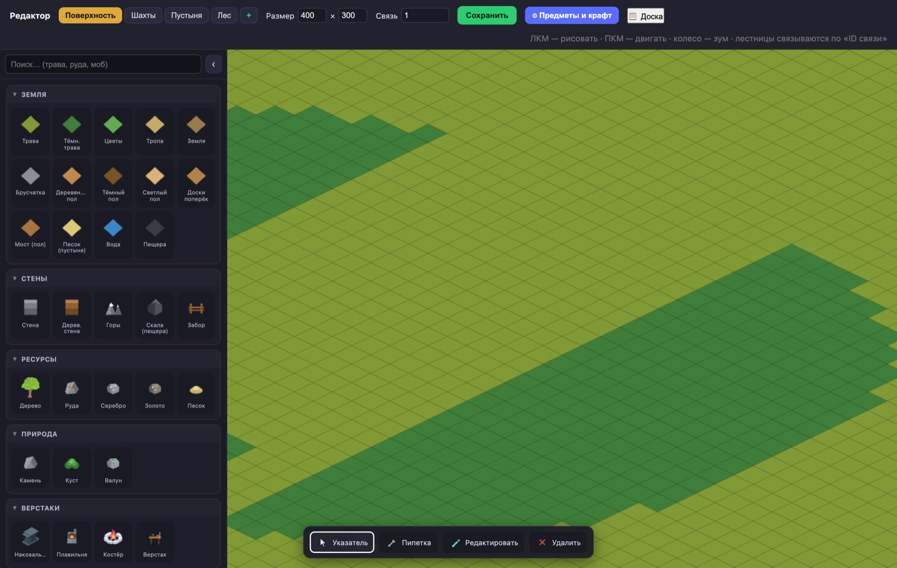

# Браузерная MMORPG

Многопользовательская онлайн-RPG в браузере: изометрическая тайловая карта, игроки видят друг друга в реальном времени, бой с мобами, лут, инвентарь, экипировка и прокачка. Референс по духу и геймплею — RPG MO.


## Архитектура

- **Сервер** (`server/`) — Node.js + Socket.IO. Держит состояние мира: карту, мобов, игроков, бой, лут. Клиент ничего не решает сам.
- **Клиент** (`client/`) — HTML5 Canvas и чистый JS, без движка. Рисует изометрию, спрайты и интерфейс.
- **Редактор карт** (`client-admin/`) — отдельная админка на `/admin`, подробности ниже.

## Редактор карт — админка на `/admin`

Мир не задан в коде: всё, что есть в игре, рисуется и настраивается в браузерной админке по адресу `<адрес сервера>/admin`. Изменения уходят на сервер и применяются вживую, без перезапуска и без правки json руками.



Что она умеет:

- **Рисование мира кистью** — земля, стены, вода, ресурсы, природа, верстаки; несколько карт (поверхность, шахты, пустыня, лес) со связями между ними, лестницы и порталы соединяются по «ID связи».
- **Конструктор мобов** — собрал моба, он попал в библиотеку и доступен на всех картах; правка расходится по всем копиям сразу.
- **Конструктор НПС** — диалоги, торговля, враждебность; своя библиотека, как у мобов.
- **Предметы и крафт** — реестр вещей, рецепты; списки экипировки в редакторе строятся из реестра по типу и слоту, поэтому новая вещь появляется в интерфейсе сама, без правки списков.
- **Квесты** — цели kill-квестов выбираются из твоих же мобов и враждебных НПС.
- **Рыбные места** — таблица рыбы настраивается один раз и ставится штампом.
- Пипетка, ластик, зум колесом, перетаскивание карты правой кнопкой.

⚠️ **Админка сейчас ничем не закрыта** — сервер пускает в неё любого, кто знает адрес (`ADMIN_PASSWORD` в `server/config.js` объявлен, но не проверяется). Для локальной разработки это удобно, но перед публичным запуском замок обязателен.

## Что уже работает

- Изометрическая карта из тайлов, синхронизация движения игроков через WebSocket
- Бой, мобы с респавном, дроп и подбор лута
- Инвентарь, экипировка по слотам, характеристики и уровни
- Реестр предметов как единственный источник правды — списки в редакторе строятся из него, а не хардкодом
- Система баланса экономики (`BALANCE.md`): цена и цена продажи выводятся из связки «тир × категория»

## Запуск

```bash
cd server && npm install && node server.js
```

Клиент открывается по адресу сервера, редактор карт — на `/admin`. Порт задаётся переменной `PORT` (по умолчанию 3000).

## Стек

Node.js, Socket.IO, HTML5 Canvas. Графика — SVG-ассеты в `client/assets/`.

## Статус

Рабочий прототип, играбельный по сети. Не сделано: аккаунты, сохранение прогресса и замок на админку — это нужно закрыть до любого публичного запуска.
